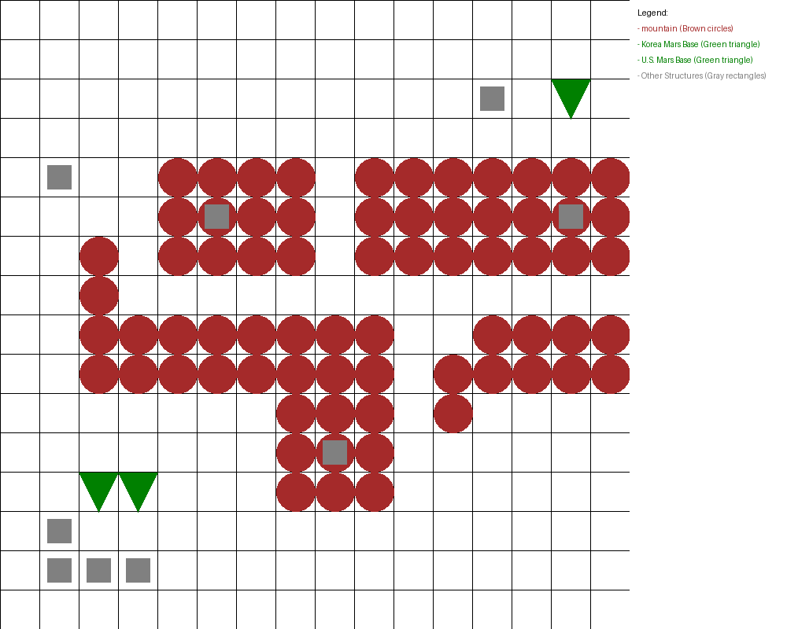
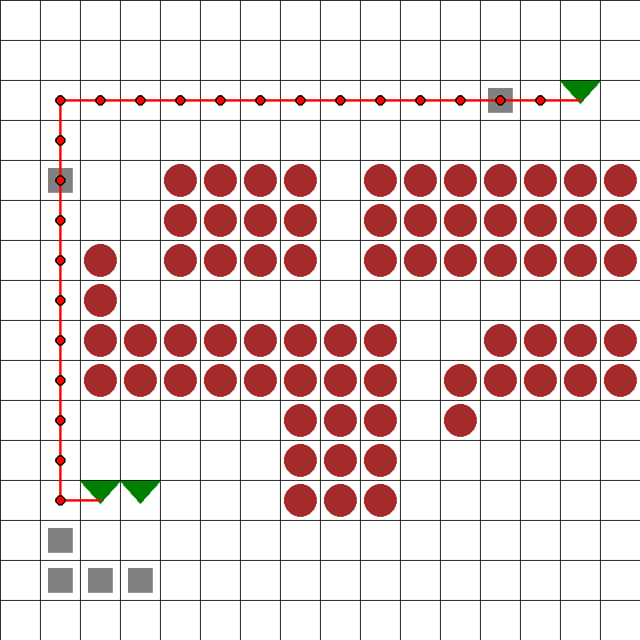
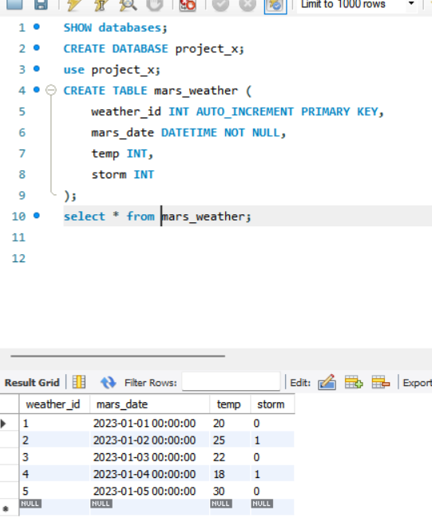

# Codyssey Mars Tools

Mars 탐사 시나리오 데이터를 지도 이미지와 MySQL 적재 유틸리티로 다루는 Python 프로젝트입니다.

## Tech Stack

- Python
- pandas
- Pillow
- MySQL Connector/Python
- tqdm

## Features

- 격자형 Mars 지형 데이터를 이미지로 렌더링
- 최단 경로 CSV를 지도 위에 시각화
- Mars 기상 CSV를 MySQL 테이블에 적재
- 공개 저장소에는 코드와 예시 이미지 자산만 포함

## Results / Highlights

- Mars 지형 CSV와 구조물 데이터를 병합해 격자 지도 이미지를 생성했습니다.
- 최단 경로 데이터를 지도 위에 오버레이해 이동 경로를 시각적으로 검증할 수 있게 했습니다.
- MySQL 적재 결과 화면을 `assets/database_result.png`로 보관해 DB 연동 결과를 확인할 수 있습니다.

| Mars map | Route overlay | DB insert result |
| --- | --- | --- |
|  |  |  |

## Project Structure

```text
.
├── assets/
│   ├── database_result.png
│   ├── mars_map.png
│   └── mars_map_final.png
├── src/
│   ├── mars_map.py
│   └── mars_weather_db.py
├── .env.example
├── .gitignore
├── requirements.txt
└── README.md
```

## Private Data

원본 CSV 데이터는 저장소에 포함하지 않습니다. 로컬 실행 시 아래 위치에 배치합니다.

```text
data/
├── problem_2/
│   ├── area_category.csv
│   ├── area_map.csv
│   └── area_struct.csv
├── problem_3/
│   └── shortest_path.csv
└── mars_weathers_data.csv
```

## Setup

```bash
python -m venv .venv
source .venv/bin/activate
pip install -r requirements.txt
```

Windows PowerShell:

```powershell
python -m venv .venv
.\.venv\Scripts\Activate.ps1
pip install -r requirements.txt
```

## Usage

Generate a Mars route map:

```bash
python src/mars_map.py
```

The rendered image is written to `assets/mars_map_final.png`.

Load weather data into MySQL:

```bash
cp .env.example .env
python src/mars_weather_db.py
```

Required environment variables:

```text
MYSQL_HOST=127.0.0.1
MYSQL_USER=root
MYSQL_PASSWORD=your_password
MYSQL_DATABASE=project_x
MARS_WEATHER_CSV=data/mars_weathers_data.csv
```

## Notes

- `data/`, generated CSV files, logs, and local database exports are ignored by Git.
- MySQL table creation is expected to be handled before running `src/mars_weather_db.py`.

## Lessons / Improvements

- CSV 기반 좌표 데이터를 이미지와 DB로 변환하면서 데이터 처리 결과를 눈으로 검증하는 흐름을 만들었습니다.
- 다음 단계에서는 MySQL table schema 생성 SQL과 단위 테스트를 추가해 재현성을 높일 수 있습니다.
